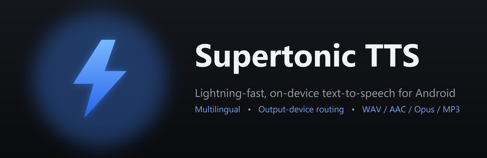
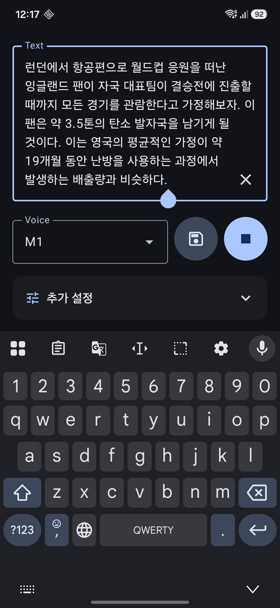
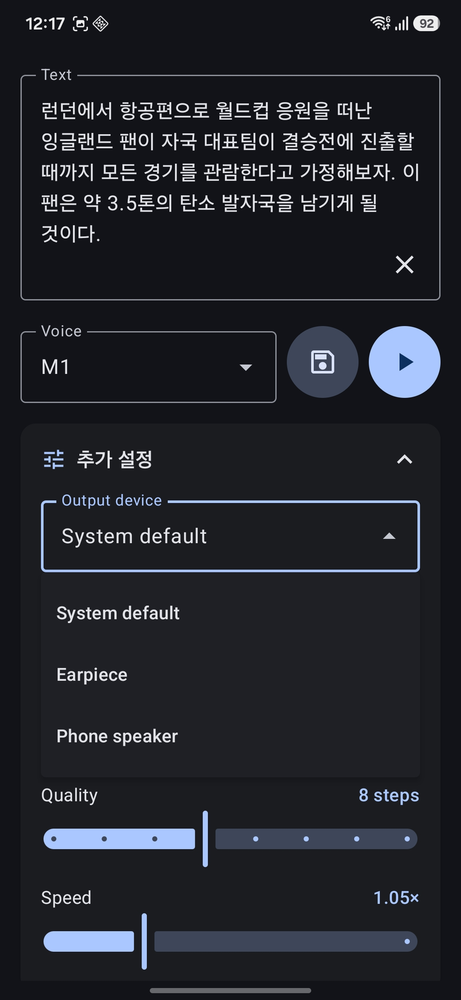
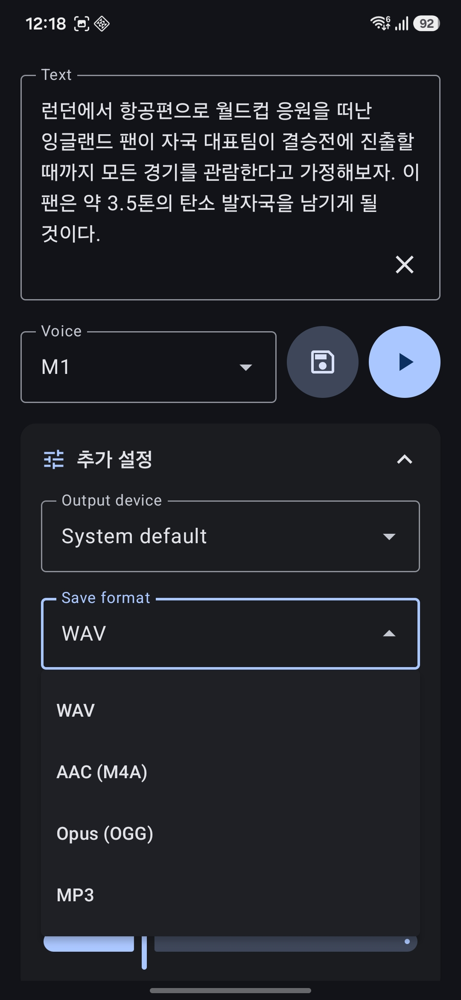
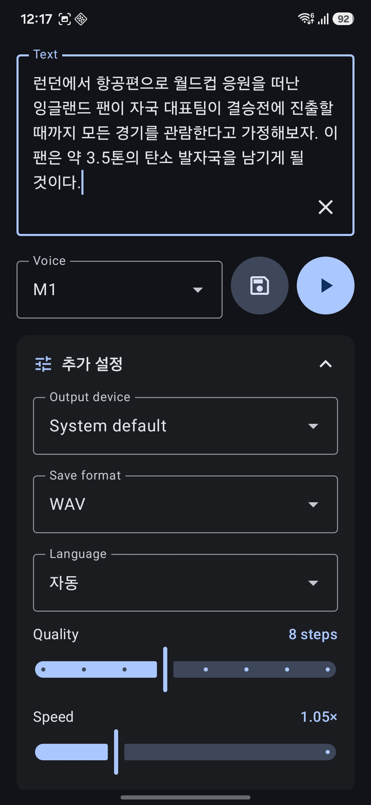

  

  <a href="../README.md">English</a> · <b>한국어</b>

# Supertonic TTS

**어떤 텍스트든 휴대폰에서 바로 자연스러운 음성으로 바꿔, 원하는 스피커로 들려주세요.**

Supertonic TTS는 온디바이스 [Supertonic 3](https://github.com/supertone-inc/supertonic) 모델로 텍스트를 음성으로 합성하는 Android 앱입니다. 음성 모델을 한 번 받고 나면 클라우드도, 계정도, 네트워크도 필요 없습니다. 음성과 출력 장치를 고르고 재생하거나, 결과를 오디오 파일로 저장하세요.

## 언제 쓰면 좋나요?

- **내 목소리가 아니라, 텍스트를 음성으로 읽어줘야 할 때.** 메시지·글·메모를 붙여넣으면 또렷한 음성으로 읽어줍니다 — 내레이션, 접근성, 언어 학습, 핸즈프리 듣기에 유용합니다.
- **조용한 곳에서 무언가를 "말로" 전달해야 할 때.** 도서관·회의·늦은 밤처럼 소리 내기 어려운 상황에서, 하고 싶은 말을 입력해 **블루투스 이어폰이나 스피커**로 보내면 직접 말하지 않고도 음성으로 전달됩니다.

## 기능

- 🔊 **온디바이스 합성** — Supertonic 3 모델을 기기에서 직접 실행하며, 최초 모델 다운로드 이후에는 완전 오프라인으로 동작합니다.
- 🎚️ **출력 장치 선택** — 폰 스피커, 유선 헤드셋, USB DAC, 또는 연결된 특정 블루투스 스피커/이어폰으로 재생합니다.
- 💾 **파일로 저장** — **WAV, AAC(M4A), Opus(OGG), MP3** 로 내보내 시스템 파일 선택기로 원하는 위치에 저장합니다.
- 🌍 **다국어** — 31개 언어 + 언어 태그 없이 처리하는 **자동(Auto)** 모드.
- 🗣️ **10가지 프리셋 음성** — 남성 5종(M1–M5), 여성 5종(F1–F5).
- 🎛️ **조절 가능** — **품질**(디노이징 스텝)과 **말하기 속도**를 조정합니다.
- 🎨 깔끔한 Material 3(Jetpack Compose) 인터페이스.

| 합성 & 재생 | 출력 장치 선택 | 저장 포맷 | 추가 설정 |
|:---:|:---:|:---:|:---:|
|  |  |  |  |

## 사용 제반 조건

- **Android 9.0 (API 28) 이상.**
- **arm64-v8a** 기기 (사실상 모든 최신 휴대폰).
- 음성 모델 저장용 **여유 공간 ~400 MB** (최초 실행 시 한 번 다운로드).
- **최초 실행 시에만 인터넷 연결 필요** (모델 다운로드용), 이후에는 오프라인.

## 사용 방법

1. **앱 설치.** [Releases](https://github.com/ouor/supertonic-android/releases)에서 `supertonic-v0.1-arm64-v8a.apk`를 받아 실행합니다. "출처를 알 수 없는 앱 설치" 허용이 필요할 수 있습니다.
2. **음성 다운로드.** 최초 실행 시 다이얼로그가 떠 모델 파일(~398 MB)을 받습니다. 이 과정은 한 번만 진행됩니다.
3. **텍스트 입력.** 입력란에 내용을 적습니다. **✕** 버튼으로 전체 지우기가 가능합니다.
4. **음성 선택.** 드롭다운에서 음성을 고릅니다.
5. **재생 ▶** 으로 듣거나, **저장 💾** 으로 오디오 파일을 내보냅니다.
6. **"추가 설정"** 을 펼쳐 다음을 설정합니다:
   - **출력 장치** — 음성이 재생될 곳 (폰·블루투스·유선·USB…).
   - **저장 포맷** — WAV / AAC / Opus / MP3.
   - **언어** — 특정 언어 또는 **자동**.
   - **품질** 과 **속도**.

> 제공되는 APK는 손쉬운 설치·테스트를 위해 디버그 키로 서명되어 있습니다. 아직 Play 스토어 배포용은 아닙니다.

## 기술 개요

- **모델 & 추론.** [Supertonic 3](https://github.com/supertone-inc/supertonic) TTS 모델을 **ONNX Runtime**(`onnxruntime-android`)으로 실행합니다. 합성은 4모델 파이프라인 — 듀레이션 예측 → 텍스트 인코더 → 벡터 추정(반복 디노이징) → 보코더 — 으로 44.1 kHz 모노 float PCM을 생성합니다. Kotlin 엔진은 공식 레퍼런스 구현을 충실히 포팅한 것입니다.
- **모델 전달.** 4개 ONNX 모델·음성 스타일·설정을 최초 실행 시 [Hugging Face 저장소](https://huggingface.co/Supertone/supertonic-3)에서 받아 앱 전용 저장소에 캐싱합니다 (이어받기·무결성 검증 지원).
- **재생 & 라우팅.** PCM을 `AudioTrack`(`ENCODING_PCM_FLOAT`)으로 스트리밍하며, `AudioManager.getDevices()`로 출력 장치를 열거하고 `AudioTrack.setPreferredDevice()`로 선택합니다.
- **오디오 내보내기.** WAV 외 포맷은 **FFmpegKit**으로 인코딩하고, WAV는 직접 기록합니다. 저장은 Storage Access Framework로 처리합니다.
- **UI.** 단일 화면 **Jetpack Compose**(Material 3) 앱으로, `ViewModel` + Kotlin 코루틴 기반입니다.
- **빌드.** Kotlin 2.2 · AGP 9 · `minSdk 28` / `targetSdk 36`. 릴리스 APK는 ABI별로 분할해 **arm64-v8a** 만 배포합니다.

## 크레딧 & 라이선스

Supertone Inc.의 오픈 웨이트 모델 **[Supertonic](https://github.com/supertone-inc/supertonic)** 을 기반으로 합니다. 모델은 자체 라이선스(OpenRAIL-M)로 배포됩니다 — [모델 카드](https://huggingface.co/Supertone/supertonic-3) 참고. 이 앱의 소스 코드는 Supertonic Android 클라이언트로서 있는 그대로(as-is) 제공됩니다.
